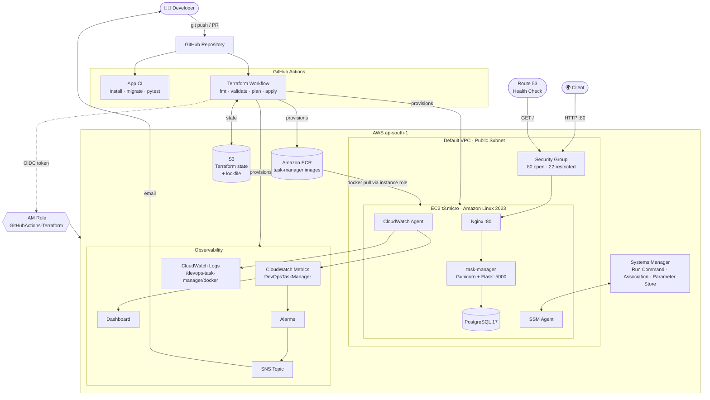
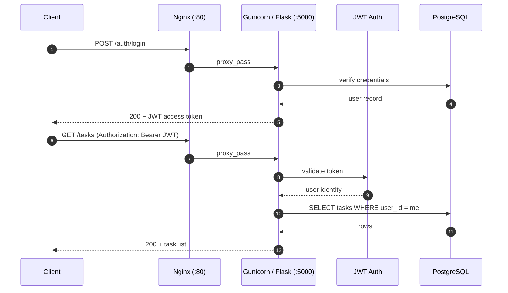
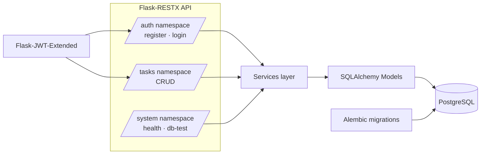
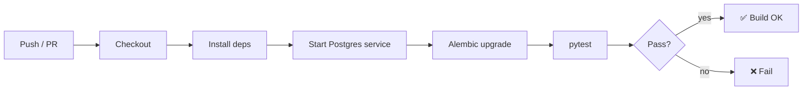
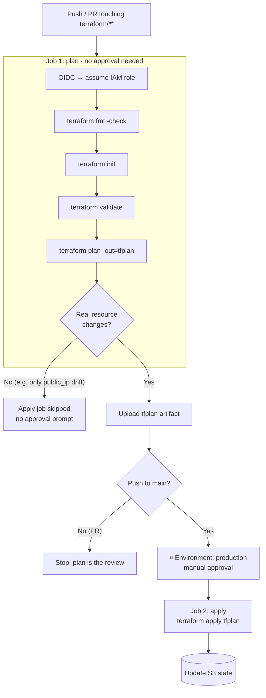
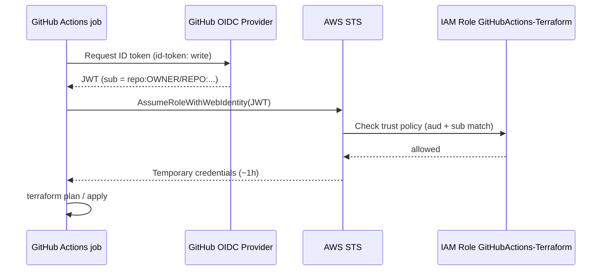
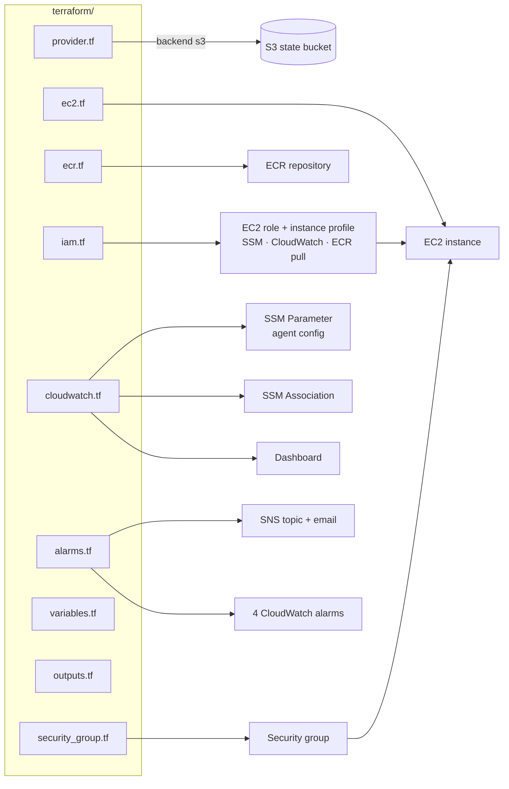
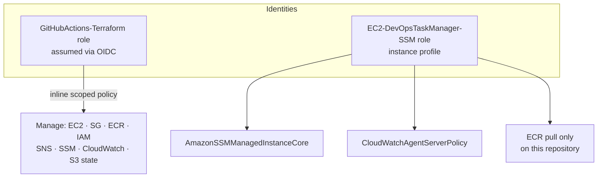
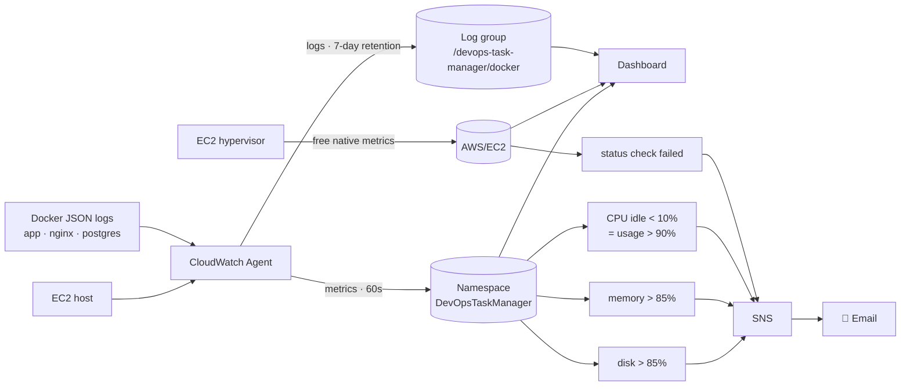

# 🚀 DevOps Task Manager

A production-style **REST API** (Flask + PostgreSQL) deployed on **AWS** with a fully automated, **infrastructure-as-code** pipeline: Docker, Nginx, Amazon ECR, Terraform with remote state, GitHub Actions using **OIDC (no long-lived AWS keys)**, and CloudWatch monitoring with alerting.

This project covers the whole lifecycle: **code → test → container → registry → infrastructure → deploy → monitor → alert.**

> **Live demo** (public IP changes when the instance is stopped/started, since no Elastic IP is used to keep costs at zero):
> API: `http://3.110.136.168/` · Swagger UI: `http://3.110.136.168/docs`
> Current IP: `terraform output ec2_public_ip`

---

## 📑 Table of Contents

1. [What This Project Demonstrates](#-what-this-project-demonstrates)
2. [Tech Stack](#-tech-stack)
3. [End-to-End Architecture](#-end-to-end-architecture)
4. [Request Flow](#-request-flow)
5. [Application Design](#-application-design)
6. [CI/CD Pipeline](#-cicd-pipeline)
7. [Infrastructure as Code (Terraform)](#-infrastructure-as-code-terraform)
8. [Security Model](#-security-model)
9. [Monitoring & Alerting](#-monitoring--alerting)
10. [Cost Control](#-cost-control)
11. [Project Structure](#-project-structure)
12. [Local Development](#-local-development)
13. [API Reference](#-api-reference)
14. [Operations Runbook](#-operations-runbook)
15. [Troubleshooting Stories](#-troubleshooting-stories)
16. [Roadmap](#-roadmap)
17. [Author](#-author)

---

## ✨ What This Project Demonstrates

| Area | What's implemented |
|---|---|
| **Backend** | Flask-RESTX API, JWT auth, user-scoped CRUD, Alembic migrations, Swagger docs |
| **Containers** | Multi-container stack (app, Nginx, Postgres) with Docker Compose, hardened containers |
| **Registry** | Images built and pushed to **Amazon ECR**, tagged by commit SHA |
| **IaC** | EC2, IAM, security group, ECR, CloudWatch, SNS, SSM all defined in **Terraform** |
| **State** | Remote state in **S3** with native lockfile locking |
| **CI/CD** | GitHub Actions: test, plan on every push/PR, gated apply only when real changes exist |
| **Auth to AWS** | **GitHub OIDC** → IAM role (no static access keys stored in GitHub) |
| **Access to server** | **AWS Systems Manager**, no need to expose SSH publicly |
| **Observability** | CloudWatch Agent (CPU, memory, disk, container logs), dashboard, alarms → email via SNS |
| **Least privilege** | Scoped IAM policies for the CI role and the EC2 instance role |

---

## 🛠 Tech Stack

| Category | Technologies |
|---|---|
| Language / Framework | Python 3.13, Flask, Flask-RESTX |
| Database | PostgreSQL 17, SQLAlchemy, Alembic |
| Auth | Flask-JWT-Extended |
| Serving | Gunicorn, Nginx (reverse proxy) |
| Containers | Docker, Docker Compose |
| Cloud | AWS EC2, ECR, IAM, S3, SSM, CloudWatch, SNS, Route 53 health checks |
| IaC | Terraform (AWS provider `~> 6.0`, S3 backend) |
| CI/CD | GitHub Actions (OIDC to AWS) |
| Docs | Swagger / OpenAPI |

---

## 🏗 End-to-End Architecture



---

## 🔄 Request Flow



Only Nginx is published on the host (`0.0.0.0:80`). The app (`5000`) and the database (`5432`) are reachable **only on the internal Docker network**.

---

## 🧩 Application Design



**Container hardening** applied in production compose:
non-root user · read-only root filesystem · dropped Linux capabilities · `no-new-privileges` · environment-based secrets · container health checks against `/system/health`.

---

## ⚙ CI/CD Pipeline

There are two independent pipelines: one for **application code**, one for **infrastructure**.

### 1. Application CI



### 2. Infrastructure pipeline (Terraform)

One workflow, `terraform.yml`, runs on every push to `main` and every pull request that touches `terraform/**`.



**Key design decisions**

- **Plan is free, apply is gated.** Only the `apply` job uses the `production` GitHub Environment, so you're prompted to approve **only when infrastructure genuinely changes**.
- **Apply uses the exact reviewed plan** (`tfplan` artifact), so what was approved is what runs.
- **No AWS keys in GitHub.** Jobs exchange a short-lived GitHub OIDC token for temporary AWS credentials.
- **Cosmetic drift is ignored.** Restarting the instance changes its public IP; Terraform reports this as an output-only sync with *no real infrastructure change*, so the apply job does not trigger.

### OIDC trust model



The role's trust policy uses `StringEquals` on `token.actions.githubusercontent.com:sub`, allowing only this repository's `main` branch, pull requests, and the `production` environment.

---

## 🏗 Infrastructure as Code (Terraform)



| File | Manages |
|---|---|
| `provider.tf` | AWS provider, S3 backend (`use_lockfile = true`) |
| `ec2.tf` | `t3.micro` instance, encrypted 8 GB gp3 root volume, IMDSv2 required |
| `iam.tf` | EC2 role + instance profile: `AmazonSSMManagedInstanceCore`, `CloudWatchAgentServerPolicy`, scoped ECR pull |
| `ecr.tf` | ECR repository for the app image |
| `security_group.tf` | HTTP 80 open; SSH restricted to one CIDR |
| `cloudwatch.tf` | Agent config in SSM Parameter Store, SSM Association that deploys it, dashboard |
| `alarms.tf` | SNS topic + email subscription, CPU / memory / disk / status-check alarms |
| `variables.tf` / `outputs.tf` | Inputs (incl. `alert_email`) and outputs (IP, IDs, ECR URL) |

**State handling:** state lives in S3, not in git and not on anyone's laptop. Your terminal and GitHub Actions both read and write the same object, and the native lockfile prevents concurrent applies. `.terraform.lock.hcl` **is** committed to pin provider versions.

---

## 🔐 Security Model



| Layer | Control |
|---|---|
| CI → AWS | OIDC federation, short-lived credentials, trust policy pinned to this repo |
| CI permissions | Inline least-privilege policy, resource-scoped where AWS supports it |
| Instance | IMDSv2 enforced, encrypted EBS, role limited to SSM / CloudWatch / ECR pull |
| Network | Only port 80 public; SSH limited to a single CIDR; DB never exposed |
| Access | SSM Run Command / Session for administration |
| App | JWT auth, hashed passwords, user-scoped data access |
| Containers | Non-root, read-only FS, dropped capabilities, `no-new-privileges` |
| Secrets | Environment variables and GitHub secrets, `*.tfvars` and `*.tfstate` git-ignored |

---

## 📈 Monitoring & Alerting



**Configuration is code.** The CloudWatch Agent JSON is stored in an SSM Parameter (`/devops-task-manager/cloudwatch-agent-config`) and delivered by an SSM Association, so there's no hand-edited config on the server.

| Signal | Source | Alarm |
|---|---|---|
| Memory used % | Agent | > 85% for 10 min |
| Disk used % (`/`) | Agent | > 85% for 10 min |
| CPU idle % | Agent (`cpu-total` dimension) | < 10% for 10 min |
| Instance status check | Native `AWS/EC2` | > 0 for 2 min |
| Container logs | Agent → CloudWatch Logs | n/a (7-day retention) |

The disk alarm has already caught a real issue: 26 Docker images had accumulated on an 8 GB volume (88% used). Pruning unused images brought it back to normal.

---

## 💰 Cost Control

| Decision | Reason |
|---|---|
| `t3.micro`, single instance | Minimal compute |
| Only 3 custom metrics (`mem`, `disk`, `cpu_usage_idle`) | Custom metrics are ~$0.30/metric/month |
| Native EC2 CPU metric on dashboard | Free |
| 4 alarms, 1 dashboard, 1 SNS topic | Within free tiers |
| 7-day log retention | Keeps log storage negligible |
| No Elastic IP | Avoids idle-IP charges (trade-off: IP changes on stop/start) |
| S3 for state | A few KB, effectively free |

Estimated monitoring cost: **under $1/month**. The instance and EBS volume are the main spend.

---

## 📁 Project Structure

```
.
├── .github/workflows/     # CI and Terraform pipelines
├── app/                   # Flask application (api, models, services, utils)
├── migrations/            # Alembic migrations
├── nginx/                 # Nginx reverse-proxy config
├── terraform/             # All AWS infrastructure as code
│   ├── provider.tf        # provider + S3 backend
│   ├── ec2.tf  iam.tf  ecr.tf  security_group.tf
│   ├── cloudwatch.tf  alarms.tf
│   ├── variables.tf  outputs.tf
│   └── .terraform.lock.hcl
├── tests/                 # pytest suite
├── docs/images/           # Screenshots
├── Dockerfile
├── docker-compose.yml         # development
├── docker-compose.prod.yml    # production
├── app.py  start.sh  init-db.sql
├── requirements.txt  pyproject.toml
└── README.md
```

---

## 🚀 Local Development

```bash
git clone https://github.com/KartikSharma0609/devops-task-manager.git
cd devops-task-manager

python -m venv venv
source venv/bin/activate          # Windows: venv\Scripts\activate
pip install -r requirements.txt

# create a .env file with your database and JWT settings
flask db upgrade
python app.py
```

**With Docker**

```bash
# development
docker compose up --build

# production-style
docker compose -f docker-compose.prod.yml up --build -d
```

**Tests**

```bash
pytest
```

Covers authentication, task CRUD, protected endpoints, database connectivity and health checks.

---

## 📚 API Reference

Interactive docs are served at **`/docs`** (Swagger UI). Protected endpoints require:

```
Authorization: Bearer <JWT_TOKEN>
```

| Group | Method | Endpoint | Auth |
|---|---|---|---|
| Auth | POST | `/auth/register` | No |
| Auth | POST | `/auth/login` | No |
| Tasks | GET | `/tasks` | Yes |
| Tasks | POST | `/tasks` | Yes |
| Tasks | PUT | `/tasks/{id}` | Yes |
| Tasks | DELETE | `/tasks/{id}` | Yes |
| System | GET | `/system` | No |
| System | GET | `/system/health` | No |
| System | GET | `/system/db-test` | No |

---

## 🧰 Operations Runbook

**Get the current public IP** (changes on every stop/start)

```bash
cd terraform && terraform output ec2_public_ip
```

**Run a command on the instance via SSM**

```bash
CMD=$(aws ssm send-command --region ap-south-1 \
  --instance-ids <INSTANCE_ID> --document-name AWS-RunShellScript \
  --parameters 'commands=["docker ps"]' --query Command.CommandId --output text)

aws ssm get-command-invocation --region ap-south-1 \
  --command-id "$CMD" --instance-id <INSTANCE_ID> \
  --query "[Status,StandardOutputContent,StandardErrorContent]" --output table
```

**Check alarms**

```bash
aws cloudwatch describe-alarms --region ap-south-1 --alarm-name-prefix task-manager \
  --query "MetricAlarms[].{Name:AlarmName,State:StateValue}" --output table
```

**Pause / resume the CloudWatch Agent**

```bash
sudo systemctl stop amazon-cloudwatch-agent && sudo systemctl disable amazon-cloudwatch-agent
sudo systemctl enable  amazon-cloudwatch-agent && sudo systemctl start amazon-cloudwatch-agent
```

**Reclaim disk space**

```bash
docker system df
docker image prune -af
```

**Confirm the SSM Association applied**

```bash
aws ssm list-associations --region ap-south-1 \
  --association-filter-list key=Name,value=AmazonCloudWatch-ManageAgent
```

---

## 🩺 Troubleshooting Stories

Real problems hit and solved while building this project.

<details>
<summary><b>1. SSM agent showed <code>ConnectionLost</code>; commands stuck in Pending</b></summary>

Worked through the layers in order: instance profile and IAM policies → security group egress → route table (found via the VPC's main table) → network ACLs → the instance itself. AWS-side config was all correct. Getting a shell through EC2 Instance Connect showed the agent had recovered after a restart and DNS, TLS and clock were healthy. Lesson: verify each layer with evidence before changing anything.
</details>

<details>
<summary><b>2. GitHub OIDC: <code>Not authorized to perform sts:AssumeRoleWithWebIdentity</code></b></summary>

The role's trust policy allowed only `repo:...:environment:production`. Workflows whose job did not declare that environment produced a different `sub` claim and were rejected. Fixed by explicitly allowing the `main` ref and `pull_request` subjects, and by making only the apply job use the environment.
</details>

<details>
<summary><b>3. Approval prompt on every push, even with no infra change</b></summary>

Split into a plan job (ungated) and an apply job (gated by the `production` environment) that runs only when the plan contains real changes. A restart-induced `public_ip` change is state-only and correctly skipped.
</details>

<details>
<summary><b>4. Terraform apply failed with AccessDenied, one action at a time</b></summary>

Terraform's AWS provider calls extra read APIs (`ListTagsForResource`, `DescribeParameters`, `GetSubscriptionAttributes`). `ssm:CreateAssociation` also needs permission on the **instance** and the **SSM document**, not just the association. The IAM policy was extended iteratively, and the partially created SNS subscription was auto-tainted and cleanly recreated.
</details>

<details>
<summary><b>5. CPU alarm stuck in <code>INSUFFICIENT_DATA</code> while data existed</b></summary>

With `totalcpu: true`, the agent publishes `cpu_usage_idle` with an extra dimension `cpu=cpu-total`. CloudWatch matches dimensions exactly, so an alarm defined with only `InstanceId` never sees the data. Fixed by adding the dimension to the alarm and dashboard widget. Found with `list-metrics`.
</details>

<details>
<summary><b>6. Disk alarm fired at 88%</b></summary>

`docker system df` showed 26 images (3 active), ~2.9 GB reclaimable from old CI/CD builds. Pruning resolved it; follow-up is automated cleanup after deploy.
</details>

---

## 🚧 Roadmap

- [ ] CloudTrail (management events) via Terraform
- [ ] S3 state bucket versioning + scheduled state backup
- [ ] Automated `docker image prune` after each deploy
- [ ] Larger root volume via Terraform
- [ ] Replace broad admin user permissions with a scoped policy
- [ ] HTTPS (ACM + load balancer or Let's Encrypt) and a domain name
- [ ] Refresh tokens, RBAC, rate limiting, API versioning (`/api/v1`)
- [ ] Prometheus + Grafana, Kubernetes / Helm

---

## 👨‍💻 Author

**Kartik Sharma** — Aspiring DevOps Engineer

- GitHub: [KartikSharma0609](https://github.com/KartikSharma0609)
- LinkedIn: [kartik-sharma-54328437a](http://www.linkedin.com/in/kartik-sharma-54328437a)

⭐ If this project helped you, consider giving it a star.
